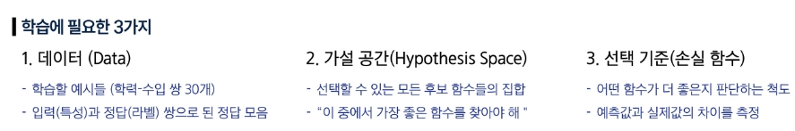
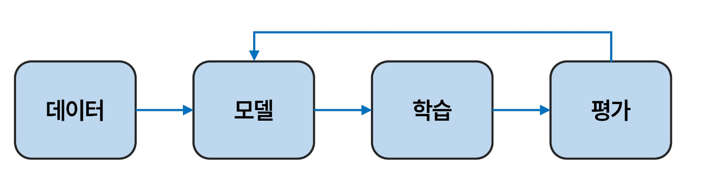
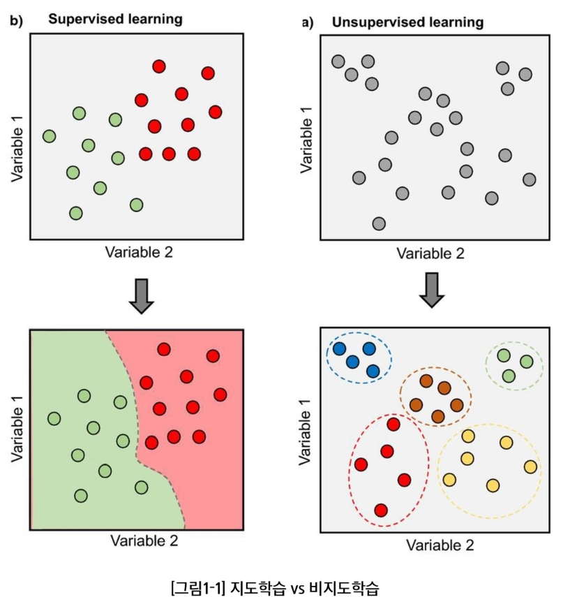
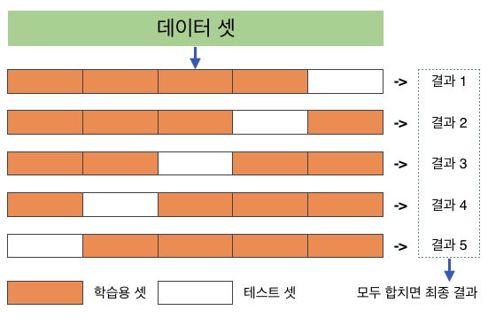
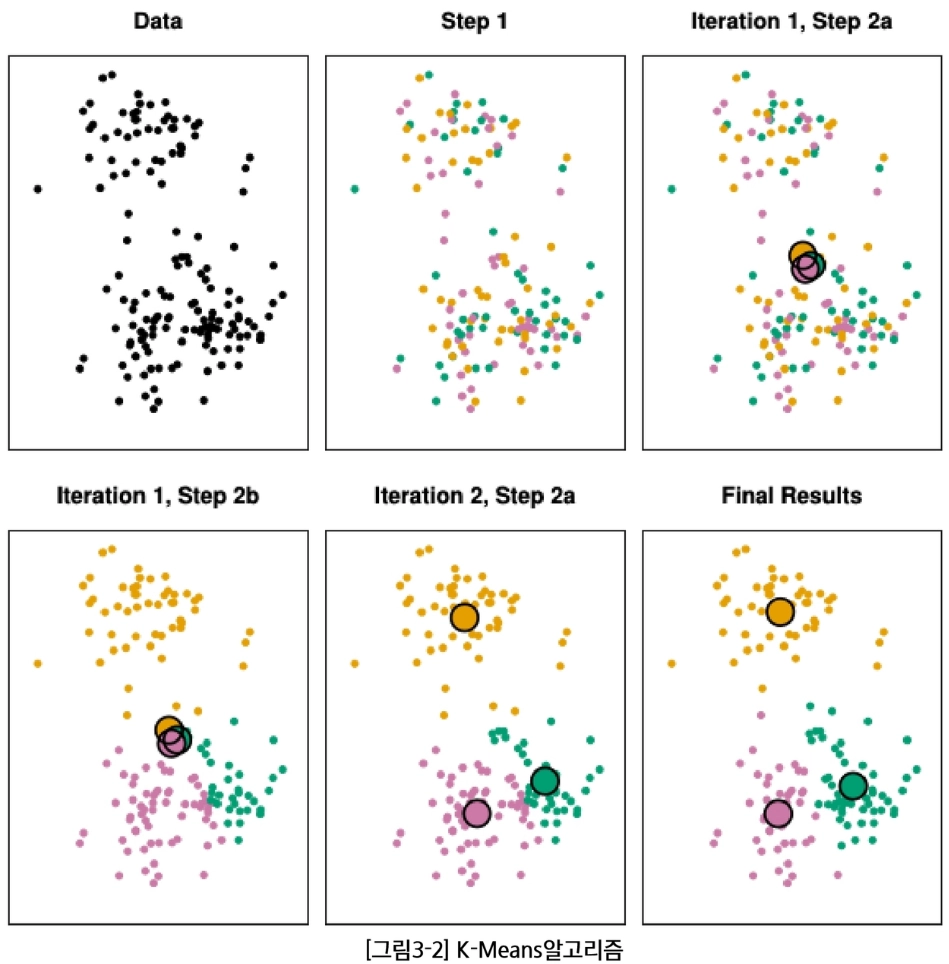

# 📝 지식 정리 노트

## 지식 정리 노트란?

* 내가 오늘 배운 내용을 내 말로 재구성하여 개념을 내재화하고, 스스로의 학습 내용을 점검하는 도구입니다.
* 자유롭게 MM 채널에 업로드하여, 나의 학습 과정을 기록하고 공유해보세요.
* 예시는 지우고, 여러분들만의 내용으로 채워나가봅시다!

---
# 📌목차
- [1. 핵심 실습 개념 요약](#1-핵심-실습-개념-요약)
  - [데이터, 모델, 학습](#데이터-모델-학습)
  - [지도 학습](#지도-학습)
  - [손실 함수 (Loss Function)](#손실-함수-loss-function)
  - [비지도 학습](#비지도-학습)
  - [K-겹 교차 검증 (K-Fold Cross Validation)](#k-겹-교차-검증-k-fold-cross-validation)
  - [K-Means](#k-means)
- [2. 주요 코드 스니펫 (주석에 힌트가 있으니 채워보아요)](#2-주요-코드-스니펫-주석에-힌트가-있으니-채워보아요)
- [3. 주의사항 & 실습 팁 (New❗)](#3-주의사항--실습-팁-new)
- [3. 주의사항 & 실습 팁 (Origin ☝️)](#3-주의사항--실습-팁-origin-️)
- [4. 적용 예시](#4-적용-예시-내가-응용해-보고-싶은-아이디어-한-가지)

## 1. 핵심 실습 개념 요약

* **AI** : 기계가 지능적으로 행동하도록 만드는 기술
* **ML** : 데이터를 통해 규칙과 패턴을 학습하는 AI
* **DL** : 신경망을 여러 층으로 구성하여 복잡한 패턴을 학습하는 머신러닝

---

### 데이터, 모델, 학습


**머신러닝의 기본 흐름**



* 머신러닝은 규칙을 직접 코딩하지 않고 **데이터에서 규칙을 학습**한다.
* 평가 결과를 바탕으로 데이터, 모델, 학습 방법을 반복해서 개선한다.

**데이터 구성 요소**

* **Feature (X)** : 모델이 예측할 때 사용하는 입력값
* **Label (y)** : 모델이 맞춰야 하는 실제 정답
* **예측값 (ŷ)** : 모델이 예측한 결과
* **오류** : 실제값과 예측값의 차이

**데이터 분리**

* **Train** : 모델을 학습시키는 데이터 (약 70%)
* **Validation** : 학습 중간에 모델 성능을 확인하는 데이터 (약 20%)
* **Test** : 학습이 끝난 모델의 최종 성능을 평가하는 데이터 (약 10%)

**데이터 전처리**

* **결측치** : 값이 비어 있는 데이터 (`null`, `NaN`)
* **이상치** : 일반적인 범위에서 크게 벗어난 데이터

---
---

### 지도 학습

> **입력(X)과 정답(y)을 함께 학습하여 새로운 데이터의 결과를 예측하는 방법**

**회귀 (Regression)**
* 결과가 **연속적인 숫자**일 때 사용
* 예: 집값, 온도, 점수

**분류 (Classification)**
* 결과가 **범주**일 때 사용
* 예: 스팸/정상, 질병 유/무, 개/고양이

---

### 손실 함수 (Loss Function)

- 모델의 예측이 실제 정답과 얼마나 다른지를 숫자로 나타내는 함수
- 학습의 목표 = Loss를 최소화하는 것

**회귀 - 평균제곱오차 (MSE)**

$$
MSE=\frac{1}{n}\sum_{i=1}^{n}(y_i-\hat{y_i})^2
$$

* 실제값과 예측값의 차이를 **제곱한 뒤 평균**
* 큰 오차에 더 큰 패널티를 줌
* 이상치에 민감함

**분류 - 교차 엔트로피 (Cross Entropy)**

$$
CE=-\sum y\log(\hat{y})
$$

* 모델이 **정답 클래스에 얼마나 높은 확률을 주었는지** 평가
* 정답 확률 ↑ → Loss ↓
* 정답 확률 ↓ → Loss ↑

---

### 비지도 학습

> **정답 없이 데이터의 특징이나 구조를 찾는 학습 방법**

대표적인 방법

* 군집화
* 차원 축소
* 이상치 탐지

```text
지도 학습 → 정답 예측
비지도 학습 → 데이터 구조와 패턴 발견
```

---


### K-겹 교차 검증 (K-Fold Cross Validation)

> 데이터를 여러 번 나누어 학습과 검증을 반복하여 **모델의 일반화 성능을 안정적으로 평가하는 방법**

**방법**

1. 데이터를 `K`개의 그룹(Fold)으로 나눈다.
2. 1개 Fold는 검증 데이터로 사용한다.
3. 나머지 `K-1`개는 학습 데이터로 사용한다.
4. 검증 Fold를 바꿔가며 총 `K`번 반복한다.
5. 각각의 평가 점수를 평균낸다.

$$
CV_{score}=
\frac{1}{K}
\sum_{k=1}^{K}L_k
$$

```text
예: K = 5

1회 → 1번 검증 / 2,3,4,5 학습
2회 → 2번 검증 / 1,3,4,5 학습
3회 → 3번 검증 / 1,2,4,5 학습
...
```

> **핵심 목적:** 한 번의 데이터 분할 결과만 믿지 않고, 모델이 새로운 데이터에서도 잘 동작하는지 신뢰성 있게 평가한다.

---

### K-Means
> 정답 없이 비슷한 특징을 가진 데이터를 **K개의 그룹으로 묶는 비지도 학습 군집화 알고리즘**

**특징**

* `K` : 만들고 싶은 클러스터 개수
* 모든 데이터는 하나의 클러스터에 포함된다.
* 클러스터의 색이나 번호 자체에는 특별한 의미가 없다.

> **좋은 군집화:** 같은 클러스터에 있는 데이터끼리 최대한 비슷하게 만드는 것

**K-Means 동작 과정**

1. `K`개의 클러스터 중심을 초기화한다.
2. 각 데이터를 **가장 가까운 중심**에 할당한다.
3. 각 클러스터 데이터의 평균으로 **새로운 중심**을 계산한다.
4. 데이터의 클러스터가 더 이상 바뀌지 않을 때까지 반복한다.


> 초기 중심 위치에 따라 결과가 달라질 수 있기 때문에 여러 번 실행하여 좋은 결과를 찾는 것이 좋다.


## 2. 주요 코드 스니펫 (주석에 힌트가 있으니 채워보아요👐)

핵심 로직을 빈칸 채우기 형태로 다시 작성해 보세요.
기억이 안 나면 다시 찾아보고, 직접 타이핑하는 연습을 해보세요!

### 데이터 불러오기 & 기초 통계

```python
df, y = load_wine(as_frame=True, return_X_y=True)
df["quality"] = y

sample_count = df.____[0]                          # 힌트: 행/열 개수를 튜플로 반환하는 속성
class_count = df["quality"].________()               # 힌트: 서로 다른 값의 개수 반환
class_distribution = df["quality"].____________().sort_index()  # 힌트: 값별 등장 횟수 계산
```

### 그룹별 통계

```python
top_alcohol_class = df.________("quality")["alcohol"].mean().________()
# 힌트1: 특정 컬럼 기준으로 데이터 묶기
# 힌트2: 값이 가장 큰 행/그룹의 인덱스 반환 (max값이 아니라 위치)

min_ash_class = df.____[df["ash"] == df["ash"].____(), "quality"].values[0]
# 힌트1: 인덱스/조건 기준으로 접근하는 방법
# 힌트2: 가장 작은 값 반환
```

### 분포 밀집도(피크) 비교

```python
bins = 20
global_min, global_max = df["proline"].min(), df["proline"].max()
peak_by_class = {}

for cls in df["quality"].unique():
    counts, _ = np.__________(               # 힌트: 구간별 데이터 개수를 계산하는 numpy 함수
        df.loc[df["quality"] == cls, "proline"],
        bins=bins,
        range=(global_min, global_max)
    )
    peak_by_class[int(cls)] = counts.____()    # 힌트: 배열에서 가장 큰 값

proline_peak_class = max(peak_by_class, key=______________)
# 힌트: 딕셔너리에서 값 기준으로 비교하려면 key= 에 뭘 넘겨야 할까? (딕셔너리명.get)
```

### 조건부 집계 & 상관관계

```python
high_magnesium_proline_mean = df.loc[
    df["magnesium"] >= df["magnesium"].________(0.9), "proline"
].mean()
# 힌트: 상위 n%를 구할 때 쓰는 분위수 함수 (0.9 = 상위 10%)

corr_with_alcohol = df.____(numeric_only=True)["alcohol"].drop("alcohol")
# 힌트: 상관계수 계산 함수

top_corr_with_alcohol = corr_with_alcohol.____().________()
# 힌트1: 음수를 없애고 크기만 비교하고 싶을 때
# 힌트2: 값이 가장 큰 인덱스(컬럼명) 반환
```

### 이상치 탐지 (IQR)

```python
def detect_outliers_iqr(data, column):
    Q1, Q3 = data[column].quantile(0.25), data[column].quantile(0.75)
    IQR = Q3 - Q1
    lower, upper = Q1 - 1.5 * IQR, Q3 + 1.5 * IQR
    return data[(data[column] < lower) | (data[column] > upper)]

outliers = detect_outliers_iqr(df, "alcohol")
df_no_outliers = df.____(outliers.index)
# 힌트: 특정 행/컬럼을 삭제하는 함수 (axis 기본값은 행 방향)
```

### Train/Test 분할 & 표준화

```python
X_train, X_test, y_train, y_test = ______________(
    X, y, test_size=0.3, random_state=42, stratify=y
)
# 힌트: sklearn.model_selection에서 데이터를 학습/평가용으로 나누는 함수

scaler = ______________()
# 힌트: 평균 0, 분산 1로 정규화하는 sklearn 클래스

scaler.____(X_train)
# 힌트: train 데이터의 평균/표준편차를 "학습"만 하는 메서드 (아직 변환은 안 함)

X_train_norm = scaler.__________(X_train)
X_test_norm = scaler.__________(X_test)
# 힌트: 학습된 기준으로 실제 데이터를 "변환"하는 메서드
```

### 로지스틱 회귀 & 평가

```python
clf = ____________________()
# 힌트: 분류 문제에 쓰는 선형 모델 (이름에 "회귀"가 들어가지만 분류 모델)

clf.____(X_train, y_train)
# 힌트: 모델을 학습시키는 메서드

y_pred = clf.________(X_test)
# 힌트: 학습된 모델로 예측값 뽑는 메서드

________________(y_test, y_pred)
# 힌트: 실제값 vs 예측값을 행렬 형태로 보여주는 함수 (TP/FP/FN/TN)

________________________(y_test, y_pred)
# 힌트: precision, recall, f1 등을 한 번에 요약해주는 함수

y_score = clf.______________(X_test)[:, 1]
# 힌트: 클래스가 아니라 "확률"을 예측하는 메서드

fpr, tpr, _ = ____________(y_test, y_score)
# 힌트: ROC 곡선을 그리기 위한 좌표(fpr, tpr)를 계산하는 함수

auc = ________________(y_test, y_score)
# 힌트: ROC 곡선 아래 면적(AUC) 값을 바로 계산해주는 함수
```

### 교차검증

```python
f1_scores = ______________(
    estimator=clf, X=X_train, y=y_train, cv=5, scoring="f1"
)
# 힌트: K-Fold 교차검증을 한 번에 수행해주는 sklearn 함수
```

### PCA + K-Means

```python
pca = ____(n_components=2)
# 힌트: 차원 축소 클래스 (주성분 분석)

X_pca = pca.______________(X)
# 힌트: fit과 transform을 한 번에 처리하는 메서드

kmeans = ________(n_clusters=2, random_state=42)
# 힌트: 군집화(클러스터링) 알고리즘 클래스

y_cluster = kmeans.______________(X_pca)
# 힌트: fit과 predict를 한 번에 처리하는 메서드
```
---

## 3. 주의사항 & 실습 팁 (New❗)

실습 중 헷갈리기 쉬운 코드, 개념, 에러 포인트를 정리합니다.

| 번호 | 주제 | 핵심 포인트 |
|---|---|---|
| 3-1 | 데이터 크기 확인 | `shape` vs `len()` |
| 3-2 | 클래스 개수 확인 | `nunique()` |
| 3-3 | 클래스별 샘플 수 | `value_counts()` |
| 3-4 | 그룹별 평균 최댓값 | `groupby()` + `idxmax()` |
| 3-5 | 표준편차 | `std(ddof=1)` |
| 3-6 | 조건 비율 계산 | Boolean 평균 |
| 3-7 | 최소값 행 찾기 | `idxmin()` + `loc` |
| 3-8 | 히스토그램 피크 | `np.histogram()` |
| 3-9 | 상위 n% 추출 | `quantile()` |
| 3-10 | 상관관계 세기 | `corr()` + `abs()` |
| 3-11 | 분포 시각화 | `sns.histplot()` |
| 3-12 | 행/열 삭제 | `drop(axis=)` |
| 3-13 | 교차검증 지표 | `scoring` 옵션 |
| 3-14 | PCA 주성분 | PC1, PC2 개념 |
| 3-15 | `&=` 연산자 | 조건 누적 결합 |
| 3-17 | 회귀 기준선 | `y = x` |

---

### 3-1. 데이터 크기 확인

> `df.shape`는 (행, 열) 튜플을 반환한다. `[0]`은 행, `[1]`은 열.

```python
sample_count  = df.shape[0]   # = len(df)
column_count  = df.shape[1]   # = len(df.columns)
```

---

### 3-2. 클래스 개수 확인

> `nunique()` = 서로 다른 값의 개수.

```python
class_count = df["quality"].nunique()
```

---

### 3-3. 클래스별 샘플 수 확인

> `value_counts()`는 빈도순 정렬이 기본값 → `sort_index()`로 클래스 번호순 정렬.

```python
class_distribution = df["quality"].value_counts().sort_index()
```

---

### 3-4. 그룹별 평균 최댓값 — `groupby()` + `idxmax()`

> `max()`는 **값**, `idxmax()`는 그 값의 **인덱스(그룹명)**를 반환한다는 차이에 주의.

```python
top_alcohol_class = (
    df.groupby("quality")["alcohol"]
      .mean()
      .idxmax()
)
```

---

### 3-5. 표준편차 — `std()`

> Pandas 기본값은 `ddof=1`(표본 표준편차). 모집단 표준편차는 `ddof=0`.

```python
malic_std = df["malic_acid"].std()        # 기본: ddof=1
malic_std_pop = df["malic_acid"].std(ddof=0)
```
**ddof=0**
- 분모를 데이터 개수 그대로인 N으로 나눕니다.
- 모집단을 구할 때 사용합니다.
- Numpy 라이브러리의 기본값
  
**ddof=1**
- 분모를 N - 1로 적용
- 불편분산(표본 표준편차)을 구할 때 사용
- Pandas 라이브러리의 기본값
---

### 3-6. Boolean 평균으로 비율 계산

> Python에서 `True=1, False=0`이므로, Boolean 평균 = 조건 만족 비율.

```python
# 방법 1: 직접 계산
high_color_ratio = df[df["color_intensity"] >= 10].shape[0] / df.shape[0] * 100

# 방법 2: Boolean 평균 (더 간결)
high_color_ratio = (df["color_intensity"] >= 10).mean() * 100
```

---

### 3-7. 최소값을 가진 행 찾기

> 인덱스가 실제 행 위치와 다를 수 있으므로, `idxmin()`과 함께 쓸 땐 `iloc`보다 `loc`이 안전하다.

```python
# 방법 1: 조건으로 접근
min_ash_class = df.loc[df["ash"] == df["ash"].min(), "quality"].values[0]

# 방법 2: 인덱스로 접근 (더 명확)
min_ash_idx = df["ash"].idxmin()
min_ash_class = df.loc[min_ash_idx, "quality"]
```

---

### 3-8. Histogram의 Peak 확인

> **피크가 높다 ≠ 값이 크다.** 특정 구간에 데이터가 얼마나 몰려 있는지를 의미한다.

```
전체 범위 확인 → 구간(bin) 분할 → 클래스별 구간 개수 계산 → 최댓값 구간 확인 → Peak 클래스 선택
```

```python
bins = 20
global_min, global_max = df["proline"].min(), df["proline"].max()
peak_by_class = {}

for cls in df["quality"].unique():
    counts, _ = np.histogram(
        df.loc[df["quality"] == cls, "proline"],
        bins=bins, range=(global_min, global_max)
    )
    peak_by_class[int(cls)] = counts.max()

proline_peak_class = max(peak_by_class, key=peak_by_class.get)
```

---

### 3-9. `quantile()`로 상위 n% 추출

> `quantile(0.9)` = 데이터의 90% 지점 → 이 값 이상이면 상위 약 10%.

```python
high_magnesium_proline_mean = df.loc[
    df["magnesium"] >= df["magnesium"].quantile(0.9), "proline"
].mean()
```

---

### 3-10. 상관계수와 `abs()`

> 방향(+/-)은 부호로, **세기**는 절댓값으로 비교한다.

```python
 # drop("alcohol"): 자기 자신과의 상관계수 1을 제거
corr_with_alcohol = df.corr(numeric_only=True)["alcohol"].drop("alcohol")
top_corr_with_alcohol = corr_with_alcohol.abs().idxmax()
```

---

### 3-11. `histplot()` 분포 시각화

```python
fig, ax = plt.subplots(figsize=(18, 5), ncols=3)

# ① 세로 방향 히스토그램 (y= 지정 시 가로 막대)
sns.histplot(data=df, y="flavanoids", bins=20, kde=True, ax=ax[0])

# ② 클래스별 분포 비교 (hue로 색상 구분)
sns.histplot(data=df, x="flavanoids", hue="quality", kde=True, ax=ax[1])

# ③ 두 변수 결합 분포 (x, y 동시 지정 → 2D 히스토그램)
sns.histplot(data=df, x="flavanoids", y="total_phenols", hue="quality", ax=ax[2])

fig.tight_layout()   # 그래프 간 여백 자동 조절
plt.show()
```

---

### 3-12. `drop()` 사용법

> `axis=0`(기본값)=행, `axis=1`=열. 컬럼을 행 인덱스로 착각하지 않도록 주의.

```python
df.drop("MEDV", axis=1)
df.drop(columns=["MEDV"])   # 동일한 결과, axis 헷갈릴 때 더 안전
```

---

### 3-13. 교차 검증 평가 지표

```python
cross_val_score(estimator=clf, X=X_train, y=y_train, cv=5, scoring="f1")
```
> 교차 검증에서는 scoring 옵션으로 모델을 어떤 기준으로 평가할지 정하는 옵션

| `scoring` | 의미 |
|---|---|
| `accuracy` | 전체 예측 중 맞춘 비율 (전체 정답률) |
| `precision` | `1`이라 예측한 것 중 실제 `1`인 비율 (정밀도) |
| `recall` | 실제 `1` 중 모델이 찾아낸 비율 (재현율) |
| `f1` | Precision·Recall의 균형 (1에 가까울수록 좋음) |
| `roc_auc` | 여러 임계값에서의 클래스 구분 능력 |

---

### 3-14. PCA 주성분

> 데이터의 특성이 너무 많을 때, 중요한 정보는 최대한 유지하면서 특성의 수를 줄이는 방법
> 주성분은 기존 컬럼 하나가 아니라, **여러 특성을 조합한 새로운 축**

- **PC1** — 데이터가 가장 많이 퍼진 방향 (설명력 최대 = 분산 최대)
- **PC2** — PC1과 직각이면서 그다음으로 많이 퍼진 방향
---

### 3-15. `&=` 연산자

> `mask_train &= 조건`  ==  `mask_train = mask_train & 조건`
> 기존 조건과 새 조건을 **모두** 만족할 때만 `True` 유지.

| 기존 | 새 조건 | 결과 |
|---|---|---|
| True | True | True |
| True | False | False |
| False | True | False |
| False | False | False |

---

### 3-17. 회귀 그래프의 `y = x` 기준선

> 실제값과 예측값이 완전히 같은 **완벽한 예측선**.

```python
min_val = min(y_test.min(), y_pred.min())
max_val = max(y_test.max(), y_pred.max())

ax.plot([min_val, max_val], [min_val, max_val], "r--")   # 동일 좌표 → y = x 직선
```


---


## 4. 적용 예시 (내가 응용해 보고 싶은 아이디어 한 가지)

오늘 배운 개념을 2학기 프로젝트나 개인 아이디어에 어떻게 활용할 수 있을지 자유롭게 적어봅니다.
2학기에 해당 내용을 바탕으로 AI로 어떤 프로젝트를 할 지 아이데이션 해볼 수 있어요!

### 팀원 A (김세헌) - 이상 트래픽 탐지 AI
> 서버의 접속 횟수, 요청 빈도, 로그인 실패 횟수, 접속 IP 등의 데이터를 분석해 평소와 다른 비정상적인 접근 패턴을 탐지하는 AI를 만들어보고 싶다.
> 이상치 탐지와 분류 모델을 활용해 장애나 비정상적인 트래픽을 빠르게 발견하는 데 적용해보고 싶다.

### 팀원 B (최현지) - 이상거래 탐지 시스템
> 오늘 배운 이상치 탐지(IQR)와 분류 모델을 결합해서, 카드/계좌 거래 데이터에서 비정상적인 패턴을 잡아내는 모델을 만들어보고 싶다.
> Precision/Recall 중 어떤 걸 우선해야 할지(놓치면 안 되는 사기 거래 vs 오탐 줄이기) 고민하는 지점이 실무적으로 흥미로울 것 같다.
